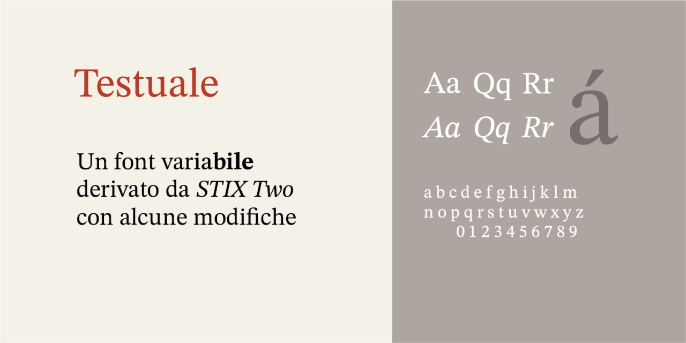
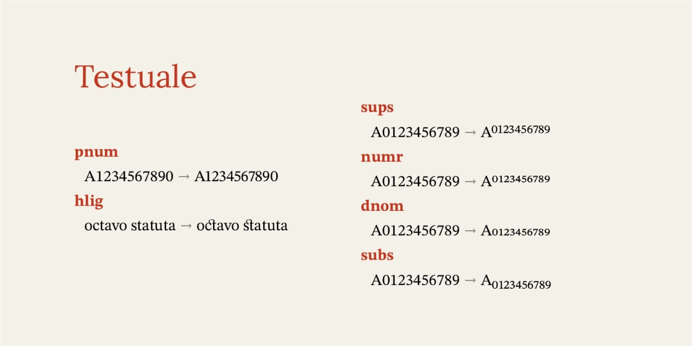

# Testuale
- Versione 1.101: aggiunta di alcune caratteristiche

Per testare il font, vedere la [pagina interattiva](https://m-casanova.github.io/Testuale/).

## Descrizione

Il font **Testuale** è derivato da _[STIX](https://github.com/stipub/stixfonts)_, distribuito con licenza OFL 1.1.

